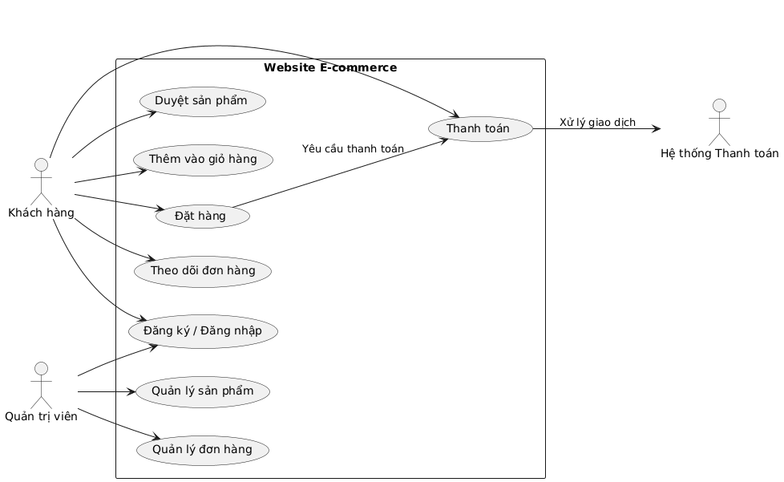
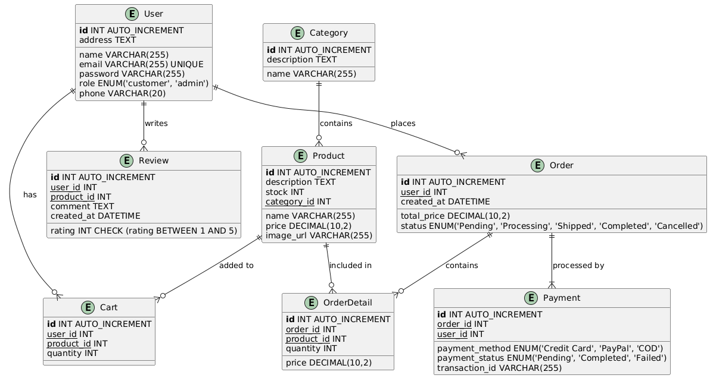

# Website sàn thương mại điện tử

## 1. Mục tiêu của dự án
Dự án này nhằm xây dựng một sàn thương mại điện tử cho phép người bán đăng sản phẩm và người mua có thể tìm kiếm, đặt hàng và thanh toán trực tuyến một cách thuận tiện. Hệ thống cung cấp các tính năng quản lý đơn hàng, giỏ hàng và thanh toán an toàn.

## 2. Các chức năng chính
- **Người dùng:** Đăng ký, đăng nhập, cập nhật thông tin cá nhân.
- **Người mua:** Tìm kiếm sản phẩm, thêm vào giỏ hàng, đặt hàng và thanh toán.
- **Người bán:** Đăng sản phẩm, quản lý đơn hàng, theo dõi doanh thu.
- **Quản trị viên:** Quản lý người dùng, sản phẩm, đơn hàng và doanh thu toàn hệ thống.

## 3. Sơ đồ Use Case

### Mô tả sơ đồ Use Case
Sơ đồ Use Case mô tả các tác nhân và cách họ tương tác với hệ thống:
- **Khách hàng** có thể đăng ký, đăng nhập, duyệt sản phẩm, thêm vào giỏ hàng, đặt hàng, thanh toán và theo dõi đơn hàng.
- **Quản trị viên** có thể quản lý sản phẩm và quản lý đơn hàng.
- **Hệ thống Thanh toán** xử lý giao dịch khi khách hàng thực hiện thanh toán.
- **Quy trình thanh toán:** Khi khách hàng đặt hàng, hệ thống gửi yêu cầu thanh toán và hệ thống thanh toán xử lý giao dịch.
## 4. Sơ đồ Class Diagram

### Mô tả sơ đồ Class Diagram
- **User**: Lưu trữ thông tin người dùng, bao gồm khách hàng và quản trị viên.
- **Category**: Danh mục sản phẩm giúp phân loại sản phẩm.
- **Product**: Chứa thông tin sản phẩm như tên, mô tả, giá cả, số lượng tồn kho và ảnh.
- **Cart**: Giỏ hàng của người dùng, liên kết với sản phẩm và số lượng tương ứng.
- **Order**: Thể hiện một đơn hàng, lưu trạng thái đơn hàng và tổng giá trị.
- **OrderDetail**: Chi tiết từng sản phẩm trong đơn hàng.
- **Payment**: Lưu thông tin thanh toán, bao gồm phương thức thanh toán và trạng thái thanh toán.
- **Review**: Đánh giá của người dùng về sản phẩm, bao gồm xếp hạng và bình luận.

Hệ thống này áp dụng mô hình **MVC (Model-View-Controller)** để quản lý dữ liệu và logic một cách hiệu quả.
