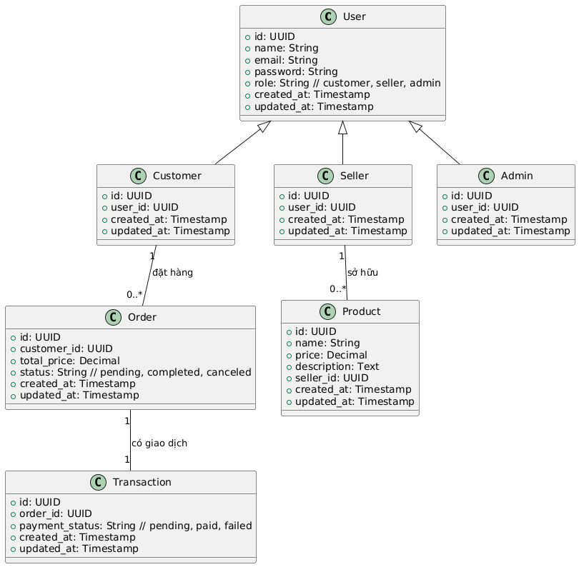

# Sàn Thương Mại Điện Tử

## Giới thiệu
Dự án này là một sàn thương mại điện tử, nơi khách hàng có thể tìm kiếm, đặt hàng sản phẩm, người bán có thể quản lý gian hàng, thêm sản phẩm, và quản trị viên có thể giám sát toàn bộ hệ thống.

## Các chức năng chính
- **Khách hàng (Customer):**
  - Đăng ký, đăng nhập.
  - Tìm kiếm sản phẩm.
  - Đặt hàng.
  
- **Người bán (Seller):**
  - Quản lý gian hàng.
  - Thêm sản phẩm.
  - Cập nhật đơn hàng.

- **Quản trị viên (Admin):**
  - Kiểm duyệt sản phẩm.
  - Quản lý người dùng.
  - Giám sát giao dịch.

## Công nghệ sử dụng
- Backend: Laravel (PHP)
- Frontend: Blade Template
- Cơ sở dữ liệu: MySQL
- ORM: Eloquent ORM
- Authentication: Laravel Auth
- Môi trường phát triển: VS Code, Laravel Sail (Docker)

## Sơ đồ Use Case


### Mô tả sơ đồ Use Case
- **Khách hàng:** Có thể đăng ký, đăng nhập, tìm kiếm và đặt hàng sản phẩm.
- **Người bán:** Có thể thêm sản phẩm, cập nhật đơn hàng và quản lý gian hàng.
- **Quản trị viên:** Kiểm duyệt sản phẩm, quản lý người dùng và giám sát giao dịch.
- **Hệ thống:** Xử lý xác thực, lưu trữ và quản lý dữ liệu giao dịch.

## Sơ đồ Lớp


### Mô tả sơ đồ Lớp
- **User:** Chứa thông tin người dùng chung.
- **Customer, Seller, Admin:** Kế thừa từ User và mở rộng chức năng.
- **Order:** Lưu thông tin đơn hàng của khách hàng.
- **Product:** Chứa thông tin sản phẩm do người bán đăng tải.
- **Transaction:** Quản lý trạng thái thanh toán của đơn hàng.

## Hướng dẫn chạy dự án
### 1. Cài đặt môi trường
- Cài đặt **Docker** và **Laravel Sail** (hoặc sử dụng XAMPP, PHP, Composer nếu không dùng Docker).

### 2. Clone dự án
```sh
git clone https://github.com/Twananh19/WEB_Advance.git
cd WEB_Advance
```

### 3. Cài đặt thư viện
```sh
composer install
npm install
```

### 4. Cấu hình môi trường
```sh
cp .env.example .env
php artisan key:generate
```
Chỉnh sửa file `.env` để kết nối với MySQL.

### 5. Khởi chạy cơ sở dữ liệu
```sh
php artisan migrate --seed
```

### 6. Chạy dự án
- Nếu dùng Laravel Sail:
```sh
./vendor/bin/sail up -d
```
- Nếu không dùng Docker:
```sh
php artisan serve
```
Truy cập `http://localhost:8000` để kiểm tra giao diện.

---
📌 **Lưu ý:** Nếu có lỗi, hãy kiểm tra lại cấu hình `.env` hoặc chạy `php artisan config:clear`. Nếu cần thêm hỗ trợ, hãy tham khảo tài liệu Laravel hoặc liên hệ nhóm phát triển.
